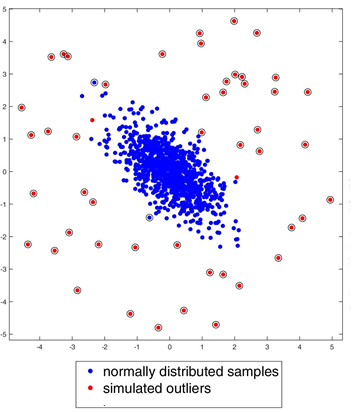
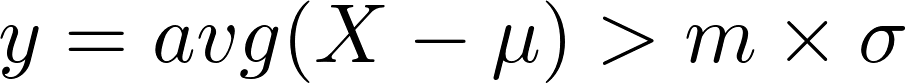

# **Finding Lane Lines on the Road** 

## By Kiril Cvetkov

---

**Finding Lane Lines on the Road**

The goals / steps of this project are the following:
* Building a pipeline that finds lane lines on the road
* Trying the pipeline on real videos

**Youtube video**

[//]: # (Image References)

[flow]: ./results/flow.jpg "Flow"
[formula]: ./results/formula.png "Formula"
[hough]:  ./results/hough.png "hough transform"

---

### Reflection

### 1. Pipeline description. Briefly description of how the pipeline works.

### My pipeline consisted of the following steps:
- Image Transformations for extracting useful structural information from the image and dramatically reduce the amount of data to be processed: 
	* Transforming the image to gray-scale
	* Applying Gaussian blur to smooth the image in order to remove the noise
    * Applying Canny transform for edge detection
- Extracting Mask from region of interest, the region that will contain the lane lines
- Applying Hough transformation on the extracted mask in order to get all the candidate lines contained in the region of interest
    * Line noise removal
    
	    After applying hough transform, we obtain the lines formed from the edges.\
	    A line `y=mx+b` is represented as (m,b), where `m` is the slope and `b` is the intercept.
	    

		
	    

        As we can see from the picture if we plot all the candidate lines as a points in 2d Axis,
	    there may be a noise points, simplified we can consider them as a points that are not representing the lane lines
	    which means their slope and intercept differs a lot and are far away from the mean.\
        Below is the proposed condition for outlier detection:
	 

 		
	 

		
		`m` : prameter that tells how much we scale from standard deviation

		`μ` : calculated mean for dataset attribute (slope, intercept)

		`X` : observed attribute sample (slope, intercept)

		`σ` : standard deviation for dataset attribute (slope, intercept)
	
	
    * Adding the new lines inside the frame buffer
    
        Once we cleaned the noise lines from the candidate lines, we should see how much they fit
	    with all the previous lines which were inserted in the past, inside the buffer.\
        If the candidate line differs a lot from the lines in the buffer, we should\
        exclude the candidate, otherwise we should include them in the buffer.
    * We get the last 20 lines inserted from the buffer, and we can construct the average line
        + Mean `slope` calculation
	    + Mean `intersect` calculation
     
    * We plot the line on our current mask
- We merge the mask together with our picture

You can see the image below, describing how the pipeline works, containing activity flow diagram

![Pipeline flow][flow]

### 2. Potential shortcomings with your current pipeline

This pipeline is not robust to the following conditions :

* If there is huge amount of noise in the region of interest (edges which are not produced from the lanes), the algorithm\
  cannot decide which one represent the lines
* Drastic changes in the lanes direction, if we are driving around twisty roads, this system won't be capable\
  to detect the lines, since we are using averages from the past frames,and also the drastic changes will be considered\
  as an outliers(noise)
  
### 3. Possible improvements to your pipeline

* We can obtain some slight improvements if we use Linear regression or for example Nearest Neighbour heuristic can help to find the hough point that has the most neighbours, so we can draw that point instead of calculating average, but it won't solve the main problems above.
* A possible solution would be the using of non-linear models that can learn how one lane is represented in the road, considering not only the edges, but many features as well.\
I think that Neural networks, especially Convolutional Neural Networks can be trained to get all
the regions(anchors) representing the lanes, so we draw curve among the anchors, with using spline interpolations or similar numeric methods.
* I think that this model will solve the shortcomings mentioned before, the best power is that we can train the model
  with data generated from different conditions with different type of noise,\
  so our system can be more robust and if properly trained, it can adapt to all drastic changes that can happen.

